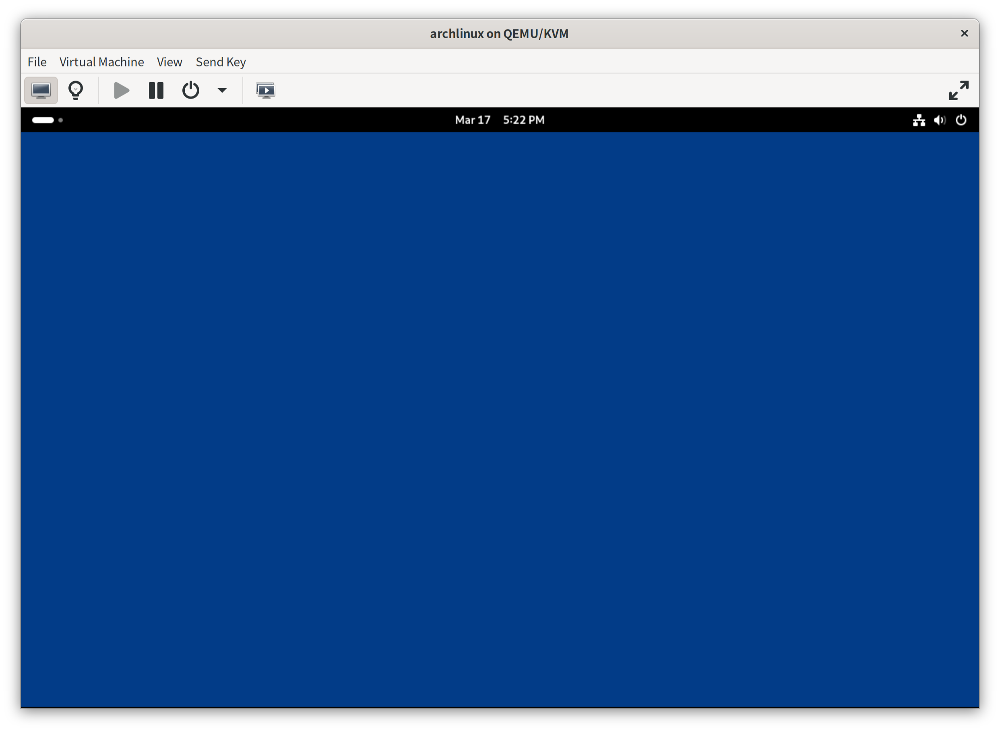
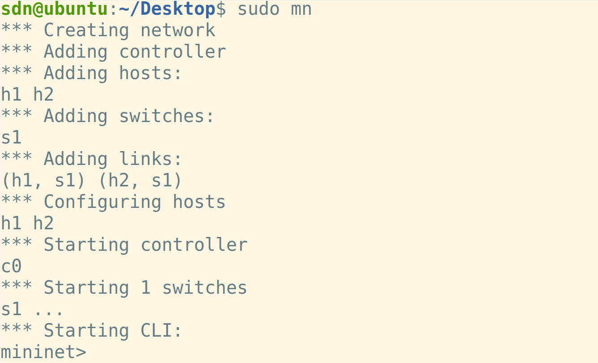
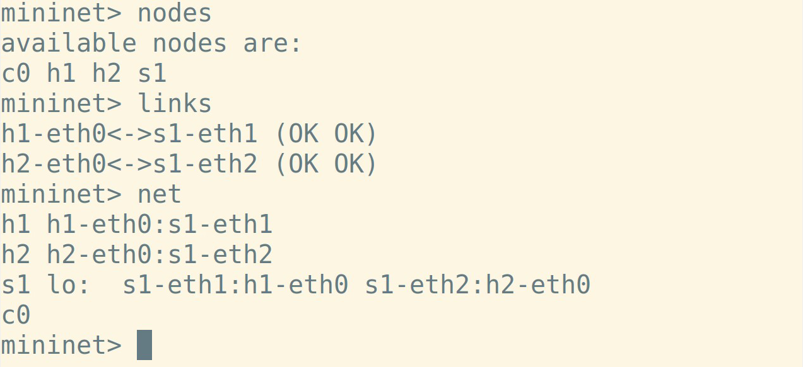
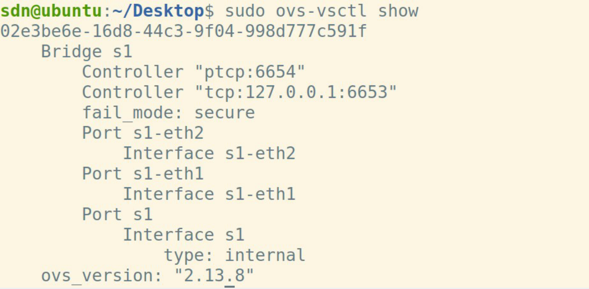
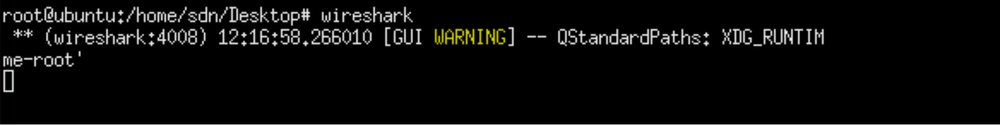
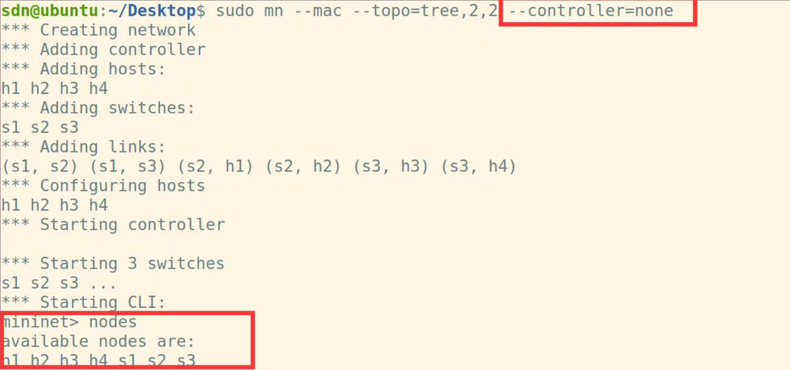
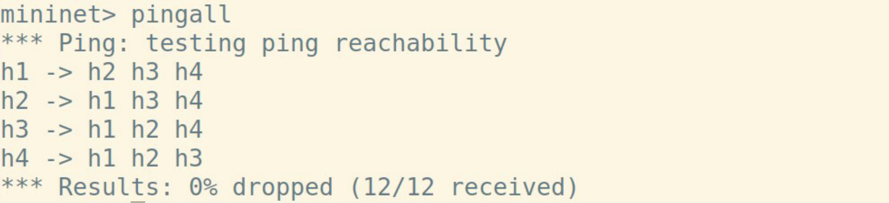
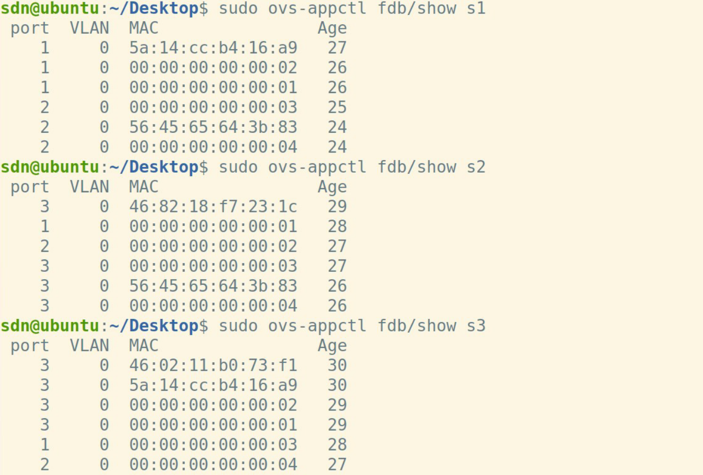
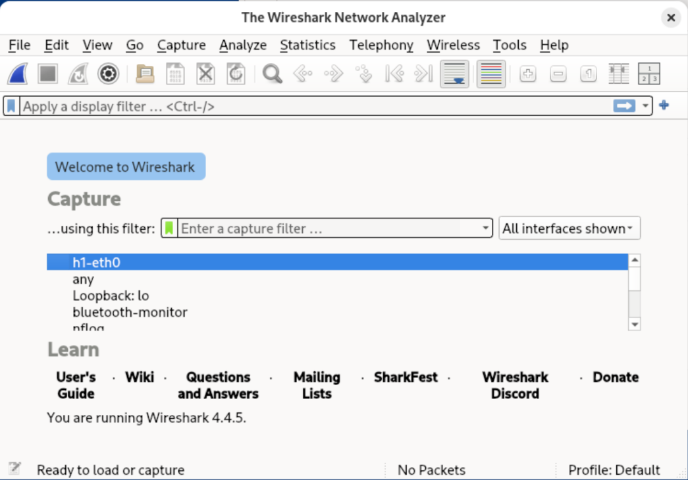

<h1 align="center">实验指导书（一）</h1>


[toc]

## 零、虚拟机使用指南

我们为SDN的课程实验配置了虚拟机。虚拟机安装了Arch Linux操作系统和Gnome桌面环境。初次使用时，你需要设置用户密码。按照开机后指引完成即可。

完成后，你会进入如下界面：



点击左上角的即可进入菜单，从左至右依次是文件管理器、wireshark、终端和Firefox浏览器。点击即可进入应用菜单。


中间的终端是实验中最常用的地方。我们鼓励你在终端内多尝试Linux的各个命令行操作。

虚拟机可以使用基本的功能；但为了更好地完成实验，你可能需要配置以下内容：

1. **X11 Xorg显示服务器和Xterm。**当然，你也可以完全使用命令行完成实验，本次实验也并不需要该功能；但建议可以安装X11服务器。之后实验中，使用Mininet的Xterm终端功能会使实验更加方便。你需要通过命令行安装：

   ```bash
   sudo pacman -S xorg-server xorg-apps xterm
   ```

   包括之后的所有安装任务，请你**仔细阅读命令行的输出，**并根据输出内容的指导进行安装。默认安装选项即可完成任务。

   [安装文档](https://wiki.archlinux.org/title/Xorg)

2. **VScode开发环境。**虚拟机配置了ssh服务器，可以通过VSCode远程连接进行开发；或者如果想在虚拟机本地进行开发，可以在虚拟机上安装VSCode：

   ```bash
   yay -S visual-studio-code-bin
   ```

   [安装文档](https://wiki.archlinux.org/title/Visual_Studio_Code)

3. **中文界面。**我们鼓励你使用英文界面，但你也可以安装中文语言包（会有很多机翻）：

   - 设置默认显示语言：编辑`~/.xprofile`，设置以下内容：

     ```bash
     export LANG=zh_CN.UTF-8
     export LANGUAGE=zh_CN:en_US
     ```

   - 安装CJK字体：推荐选择思源黑体（Adobe发行Source Han Sans `adobe-source-han-sans-cn-fonts` 或 Google发行Noto Fonts `noto-fonts-cjk`），也可以在以下注释的字体中选择：

     ```bash
     sudo pacman -S noto-fonts-cjk
     # adobe-source-han-sans-cn-fonts
     # adobe-source-han-serif-cn-fonts
     # wqy-microhei
     # wqy-microhei0kute
     # wqy-bitmapfont
     # wqy-zenhei
     # ttf-arphic-ukai
     # ttf-arphic-uming
     ```

   [安装文档](https://wiki.archlinux.org/title/Localization/Simplified_Chinese)

4. **虚拟机共享剪切板 / 文件夹**。此项和你的虚拟机软件有关：

   1. VirtualBox:

      ```bash
      sudo pacman -S virtualbox-guest-utils
      sudo systemctl enable vboxservice.service
      ```

      [安装文档](https://wiki.archlinux.org/title/VirtualBox/Install_Arch_Linux_as_a_guest)

   2. VMWare

      ```bash
      sudo pacman -S open-vm-tools gtkmm3
      sudo systemctl enable vmtoolsd.service vmware-vmblock-fuse.service
      ```

      [安装文档](https://wiki.archlinux.org/title/VMWare/Install_Arch_Linux_as_a_guest)

   3. KVM / Libvirt / Virt-manager / Spice

      ```bash
      sudo pacman -S spice-vdagent
      sudo systemctl enable spice-vdagentd.service

   安装完成后，重启虚拟机。

5. 我们鼓励你自行配置实验机器，加入你想要的个性化。如果你对Ubuntu等操作系统比较熟悉，但并不熟悉Arch Linux，你需要注意到两者的不同：

   1. Arch Linux使用`pacman`进行包管理。为了安装软件，你需要输入

      ```bash
      pacman -S PACKAGE_NAME(s)
      ```

      而不是

      ```
      apt install PACKAGE_NAME(s)
      ```

      。

   2. 软件包的名称也可能有所不同，你可以在https://archlinux.org/packages/中搜索，或使用命令`pacman -Ss KEYWORD`来搜索。

   我们选用Arch Linux的原因之一是，Arch Linux是文档最为全面、详细、易读的Linux发行版之一。你可以在[ArchWiki](https://wiki.archlinux.org/title/Main_page)上搜索到你可能遇到的很多问题的答案，也可以参与社区讨论；如有遇到其他问题助教们也会尽量给出答复。

## 一、实验环境搭建

- **方式1（推荐）**：使用虚拟机镜像搭建。
  
  -    **虚拟机软件：**可以选用Oracle VirtualBox或者VMWare Workstation Pro（Windows）/ VMWare Fusion（Mac）。两者都是免费的。
       -    VirtualBox（推荐），可在官网自行下载: https://www.virtualbox.org/wiki/Downloads
  
       -    VMWare Workstation Pro/Fusion。VMWare是闭源软件，仅可免费个人使用，下载前需要注册账号: https://support.broadcom.com/group/ecx/free-downloads。
  
  -    本实验提供虚拟机镜像文件（`sdnexp-2025.ova`），已配置`Mininet`和`Ryu`。
  -    环境搭建步骤如下：
    - 安装对应虚拟机软件
    - 导入镜像文件`sdnexp-2025.ova`并运行。
  
- 方式2：从源代码 / 包管理安装。你需要有可以使用的Linux系统。

  - Debian / Ubuntu:

    ``` bash
    # 参考视频
    # `Workstaion`和`Ubuntu`的安装：https://www.bilibili.com/video/BV1ng4y1z77g
    # SDN环境搭建（`Mininet`）：https://www.bilibili.com/video/BV1nC4y1x7Z8
    
    # 安装mininet
    git clone https://github.com/mininet/mininet.git
    cd mininet/util 
    sudo ./install.sh -n3v
    
    # 安装wireshark
    sudo add-apt-repository ppa:wireshark-dev/stable
    sudo apt update
    sudo apt install wireshark
    ```

  - Fedora / RHEL

    ```bash
    sudo dnf install mininet wireshark
    ```

  - Arch Linux (AUR，需要yay工具)

    ```bash
    sudo pacman -S wireshark-qt
    yay -S mininet
    ```

## 二、实验工具介绍

### 1. 整体框架

实验需要用到`Mininet`、`Open vSwitch`、`WireShark`等工具。

- `Mininet`: 用来在单台计算机上创建一个包含多台网络设备的虚拟网络。
- `Open vSwitch`: `Mininet`中使用的虚拟交换机。
- `WireShark`: 抓包工具。

### 2. Mininet

#### 2.1 Mininet命令行

- 启动`mininet`

```shell
# shell prompt
mn -h # 查看mininet命令中的各个选项
sudo mn -c # 不正确退出时清理mininet
sudo mn #创建默认拓扑，两个主机h1、h2连接到同一交换机s1
```



- 常用命令

```shell
# mininet CLI 中输入
nodes # 查看网络节点
links # 查看网络连接的情况
net # 显示当前网络拓扑
dump # 显示当前网络拓扑的详细信息
xterm h1 # 给节点h1打开一个终端模拟器
sh [COMMAND] # 在mininet命令行中执行COMMAND命令
h1 ping -c3 h2 # 即h1 ping h2 3次
pingall # 即ping all
h1 ifconfig # 查看h1的网络端口及配置
h1 arp # 查看h1的arp表
link s1 h1 down/up # 断开/连接s1和h1的链路
exit # 退出mininet CLI
```



#### 2.2 创建拓扑

- <span id="cli">命令行拓扑</span>

  ```shell
  sudo mn --mac --topo=tree,m,n
  ```

  --mac 指定mac地址从1开始递增，而不是无序的mac，方便观察。

  --topo 指定拓扑参数，可选用single和linear等参数。

- 自定义拓扑（方式1）：使用`Mininet Python API`创建自定义拓扑（你需要自己创建这个文件），并通过命令行运行：

  ```python
  from mininet.topo import Topo
  
  class MyTopo( Topo ):
      "Simple topology example."
  
      def build( self ):
          "Create custom topo."
  
          # Add hosts and switches
          leftHost = self.addHost( 'h1' )
          rightHost = self.addHost( 'h2' )
          leftSwitch = self.addSwitch( 's3' )
          rightSwitch = self.addSwitch( 's4' )
  
          # Add links
          self.addLink( leftHost, leftSwitch )
          self.addLink( leftSwitch, rightSwitch )
          self.addLink( rightSwitch, rightHost )
  
  
  topos = { 'mytopo': ( lambda: MyTopo() ) }
  ```
  
  命令行运行：

  ```shell
  sudo mn --custom 拓扑文件名.py --topo mytopo --controller=none
  ```
  
- 自定义拓扑（方式2）：使用`Mininet Python API`直接创建并运行网络
  
  ```python
  # sudo python topo_recommend.py
  from mininet.topo import Topo
  from mininet.net import Mininet
  from mininet.cli import CLI
  from mininet.log import setLogLevel
    
  class S1H2(Topo):
      def build(self):
          s1 = self.addSwitch('s1')
          h1 = self.addHost('h1')
          h2 = self.addHost('h2')
    
          self.addLink(s1, h1)
          self.addLink(s1, h2)
  
  
  def run():
      topo = S1H2()
      net = Mininet(topo)
  
      net.start()
      CLI(net)
      net.stop()
  
  
  if __name__ == '__main__':
      setLogLevel('info') # output, info, debug
      run()
  ```
  
  

这种方式写法较为复杂，但简化了运行命令：

```
  sudo python 拓扑文件名.py
```

#### 2.3 参考文档

进一步学习可以参考`Mininet`官网：http://mininet.org/ 

### 3. OVS

#### 3.1 实验中常用的几条指令

- 查看交换机的基本信息

以默认拓扑启动`mininet` ，打开新终端，输入`sudo ovs-vsctl show`





- 生成树协议

```shell
sudo ovs-vsctl set bridge s1 stp_enable=true #开启STP，s1为设备名
sudo ovs-vsctl get bridge s1 stp_enable
sudo ovs-vsctl list bridge
```

- 查看mac表

  - 启动`mininet`，注意禁用控制器，否则mac表可能学习不到内容

  

  - 对每个交换机执行`sudo ovs-vsctl del-fail-mode xx`，否则mac表将仍然学习不到东西

  

  - `pingall`令所有主机发送数据包，防止沉默主机现象

  

  - `sudo ovs-appctl fdb/show xx`查看mac表

  

#### 3.2参考文档

`OVS`的详细学习可参考官方网站http://www.openvswitch.org/

### 4. WireShark

- 虚拟机上的wireshark可以直接抓取交换机的包。在mininet CLI中执行`主机名/交换机名 wireshark`，则可以抓取主机/交换机的包，例如：

  ```
  h1 wireshark
  ```

  

## 三、实验任务

- 使用`Mininet`的Python API搭建`k=4`的`fat tree`拓扑；
- 使用`pingall`查看各主机之间的连通情况;
- 若主机之间未连通，分析原因并解决（使用`wireshark`抓包分析）
- 若主机连通，分析数据包的路径（提示：`ovs-appctl fdb/show`查看MAC表）
- 完成实验报告并提交到思源学堂
- 要求**不能使用控制器**

